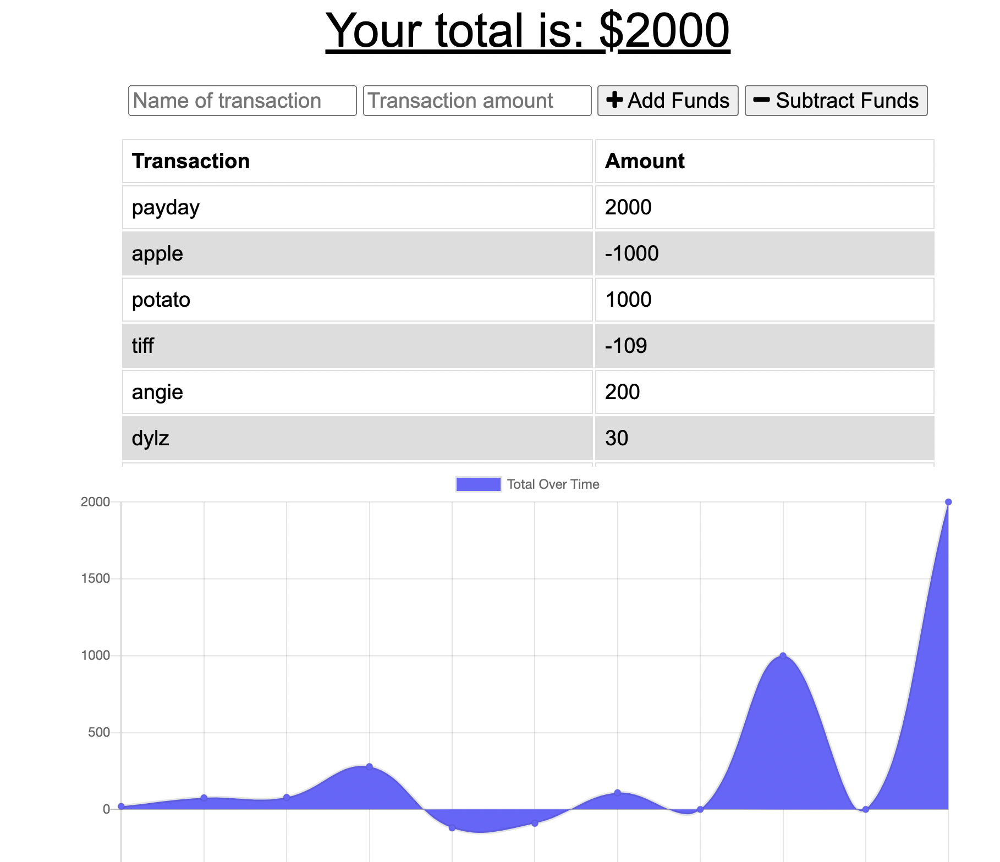

# Penny-Saver-HW19
Budget save is a WPA that allows users to add and subtract funds from their money pool and track their expenses/savings regardless whether they are online or offline.

## The Creators:

Dylson - https://github.com/Dylson14 \

## Challenges:

* Developing offline functionality
* Uploading to Heroku

## Successes:

* Successfully created offline functionality
* created the webpack config file smoothly

## Application Requirements

* Use MongoDB, IndexDb
* deployed to heroku
* save data from offline entries to a database when online

## Overall

We have made a really good app in such a short time considering it was our first time working together. It has a lot of scalibility and as such a popular game im sure many people will find it useful.

## Links to Project:

https://github.com/Dylson14/Penny-Saver-HW19

## App Screenshot:

